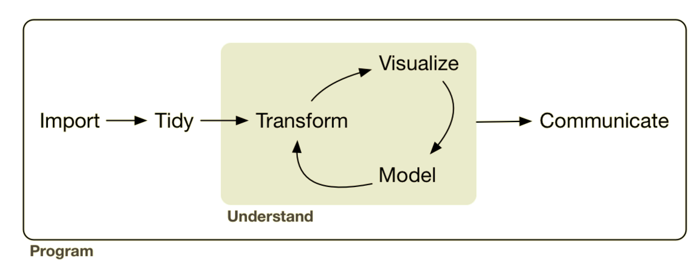

```{r setup, include=FALSE}
options(htmltools.dir.version = FALSE)
knitr::opts_chunk$set(warning = FALSE, 
                      message = FALSE, 
                      cache = TRUE, 
                      fig.align = 'center',
                      fig.height = 6)
old.hooks <- fansi::set_knit_hooks(knitr::knit_hooks)
options(crayon.enabled = TRUE)
```


background-image: url(img/ArcGIS_logo.png)

???

Start by asking:
- Who does some spatial work - in any software, ArcGIS, R, or anything else?
- Who does some spatial work in R?
- I'm going to try to convince you 
  - why you would want to do spatial work in R
  - that it's not that hard
  - highlight a few key packages, including the 'bcmaps' package that we've made

---

# Data Science
.center[]

.footnote[Wickham and Grolemund: [R for Data Science](http://r4ds.had.co.nz/)]

???

- hyped word, lots of definities out there
- To me - it's data analysis but inclusive of all steps of the data cycle, with a greater emphasis on programming.
- Spatial analysis can easily be fit into this framework, another side of the same coin.

---

# Geographical Data Science
.center[]

.footnote[Wickham and Grolemund: [R for Data Science](http://r4ds.had.co.nz/)]

???

- movement labelled Geographical Data Science (GDS). Combines ‘data science’ with GIS.
- focus on reproducibility and programming interface

---

### .center[Geographic Information Systems (GIS)</br>vs</br>Geographic Data Science (GDS)<sup>1</sup>]

.middle[
```{r echo=FALSE}
library(readr)
tbl_11.1 <- read_csv('Attribute,GIS,GDS
Home disciplines,Geography,"Geography, Computing, Statistics"
Software focus,Graphical User Interface,Code
Reproducibility,Minimal,Maximal')

knitr::kable(tbl_11.1, format = "html")
```
]

.footnote[
[1] Lovelace, Nowosad, and Muenchow: Geocomputation with R ([Table 1.1](https://geocompr.robinlovelace.net/intro.html#tab:gdsl))
]

???

Why R for spatial?

- reading, writing and manipulating spatial data; making static and interactive maps; and spatial statistics and modelling

- Ability to seamlessly switch between spatial and non-spatial data processing, modeling and visualization tasks, 

- and create a fully reproducible workflow combining all these tasks

---
class: inverse, middle, center


???

- The main package for doing spatial analysis in R is `sf`
- Stands for 'simple features', a standard way representing geographic features (points, lines, polygons etc) and their attributes.
 - can read and write almost any spatial format
 - Can perform a huge array of spatial operations

---
class: middle

.left-column[
<br>
<br>
<br>
# sp 

# rgdal

# rgeos
]

.right-column[

]

---

background-image: url(img/databc-ski-resorts.png)

---
### Read data with `st_read()` or `read_sf()`

```{r}
library(sf)
ski_resorts <- read_sf("data/GSR_SKI_RESORTS_SV.geojson")
ski_resorts
```

???

- read_sf is clever - reads many many formats without having to do a whole bunch of magical incantations.
- Read in geojson file - have a look. Looks like a data.frame, but some special
stuff.
- Each row has a geometry associated with it (in this case a point)
- Metadata at the top - what type it is (POINT), the bounding box, and the projection

---
## plotting `sf` objects

```{r}
plot(ski_resorts)
```

???

Plotting - built-in in sf
- kind of annoying, not very pretty
---
## plotting `sf` objects

```{r}
plot(st_geometry(ski_resorts))
```

???

If only interested in plotting geometry(not attributes), use 
st_geometry

---
## plotting `sf` objects with **ggplot2**

```{r}
library(ggplot2)
ggplot(ski_resorts) + 
{{  geom_sf() }}
```

??? 

Plotting even better with ggplot2
- special geom - geom_sf in latest version

---
## Interactive exploration with **mapview**

```{r}
library(mapview)
mapview(ski_resorts)
```

---
class: inverse, middle, center


---
class: bottom, right

background-image: url(img/bcmaps_readme.png)

## https://github.com/bcgov/bcmaps

???

on CRAN
---
## **bcmaps** layers
```{r}
# install.packages("bcmaps")
library(bcmaps)
available_layers()
```

---

```{r, echo=FALSE}
library(DT)
library(dplyr)
available_layers() %>% 
  select(layer_name, title) %>% 
  datatable(fillContainer = FALSE, 
            options = list(pageLength = 11, lengthChange = FALSE, filter = FALSE))
```

???

- Each layer is available by calling the function of the same name

---
```{r}
bc <- bc_bound()
ggplot() + 
{{  geom_sf(data = bc, aes(fill = island)) }}
```

---

```{r, tidy=FALSE}
bc <- bc_bound()
neighbours <- bc_neighbours()
ggplot() + 
{{ geom_sf(data = neighbours) }} +
{{ geom_sf(data = bc, aes(fill = island)) }}
```

---
## Something more interesting

Let's say we want to find the number of ski resorts in each natural 
resource region. Let's plot it first

```{r, include=FALSE}
# Hack to make a simplified version of nr_reg so slides render faster
nr_reg <- rmapshaper::ms_simplify(nr_regions())
nr_regions <- function() nr_reg
```

.pull-left[
```{r ggmap-nr-ski, eval=FALSE}
nr_reg <- nr_regions() %>% 
  select(REGION_NAME)

ggplot() + 
  geom_sf(data = nr_reg, 
          aes(fill = REGION_NAME)) + 
  geom_sf(data = ski_resorts) + 
  theme(legend.position = "none")
```
]

.pull-right[
```{r, ref.label='ggmap-nr-ski', echo=FALSE}

```

]

---
## `sf::st_intersection()`

Intersect the ski resorts points with the polygons of natural resource 
regions to get the attributes of the underlying NR region for each point

```{r, eval=FALSE}
st_intersection(ski_resorts, nr_reg)
```

---
## `sf::st_intersection()`

Intersect the ski resorts points with the polygons of natural resource 
regions to get the attributes of the underlying NR region for each point

```{r, error=TRUE}
st_intersection(ski_resorts, nr_reg)
```
---
## Projections and Coordinate Reference Systems:
- Projections try to transform the earth from its spherical shape (3D) to a planar shape (2D) so that maps can be made on flat layers.

- A Coordinate reference system (CRS) defines how the two-dimensional, 
projected map is related to real locations on the earth using coordinates.

```{r}
st_crs(ski_resorts)
st_crs(nr_reg)
```

???

EPSG codes are very handy ways to refer to CRSs so we don't have to know those long meaningless strings
---
## `sf::st_transform()`

```{r}
{{ski_resorts_bc_albers <- st_transform(ski_resorts, 3005)}}
st_crs(ski_resorts_bc_albers, nr_reg)
```

---
## `bcmaps::transform_bc_albers()`

```{r}
{{ski_resorts_bc_albers <- transform_bc_albers(ski_resorts)}}
st_crs(ski_resorts_bc_albers, nr_reg)
```
---
## `sf::st_intersection()`

```{r}
resorts_reg <- st_intersection(ski_resorts_bc_albers, nr_reg)
resorts_reg
```

---
```{r}
ggplot(resorts_reg, aes(x = REGION_NAME)) + 
  geom_bar() +
  coord_flip() + 
  labs(title = "Number of ski resorts in B.C. NR Regions")
```

---
We can go the other way to get the number of ski resorts into each 
NR region

```{r}
resorts_in_regions <- st_contains(nr_reg, ski_resorts_bc_albers)
resorts_in_regions
```

---
Create a choropleth map showing the regions with the most ski resorts
```{r}
resorts_in_regions <- st_covers(nr_reg, ski_resorts_bc_albers)
nr_reg$num_resorts <- lengths(resorts_in_regions)
ggplot(nr_reg) + 
  geom_sf(aes(fill = num_resorts))
```

---
exclude: true
### geometry generating logical operators

* `st_union`: union of several geometries
* `st_intersection`: intersection of pairs of geometries
* `st_difference`: difference between pairs of geometries
* `st_sym_difference`: symmetric difference (`xor`)

---
exclude: true
### logical binary geometry predicates

* `st_intersects`: touch or overlap
* `st_disjoint`: !intersects
* `st_touches`: touch
* `st_crosses`: cross (don't touch)
* `st_within`: within
* `st_contains`: contains
* `st_overlaps`: overlaps
* `st_covers`: cover
* `st_covered_by`: covered by
* `st_equals`: equals
* `st_equals_exact`: equals, with some fuzz

---
exclude: true
### higher-level operations: summarise, interpolate, aggregate, st_join

* `aggregate` and `summarise` use `st_union` (by default) to group feature geometries
* `st_interpolate_aw`: area-weighted interpolation, uses `st_intersection` to interpolate or redistribute attribute values, based on area of overlap:
* `st_join` uses one of the logical binary geometry predicates (default: `st_intersects`) to join records in table pairs

---
exclude: true
### manipulating geometries

* `st_line_merge`: merges lines
* `st_segmentize`: adds points to straight lines
* `st_voronoi`: creates voronoi tesselation
* `st_centroid`: gives centroid of geometry
* `st_convex_hull`: creates convex hull of set of points
* `st_triangulate`: triangulates set of points (not constrained)
* `st_polygonize`: creates polygon from lines that form a closed ring
* `st_simplify`: simplifies lines by removing vertices
* `st_split`: split a polygon given line geometry
* `st_buffer`: compute a buffer around this geometry/each geometry
* `st_make_valid`: tries to make an invalid geometry valid (requires lwgeom)
* `st_boundary`: return the boundary of a geometry

---
## Resources

.pull-left[

]

.pull-right[

https://geocompr.robinlovelace.net/

https://github.com/bcgov/bcmaps

http://r4ds.had.co.nz/

http://r-spatial.org/

]

.footnote[Source code for this presentation available [here](https://github.com/ateucher/vic-geogeeks-2018-01-30)

Made with [xaringan](https://slides.yihui.name/xaringan/)
]
---
