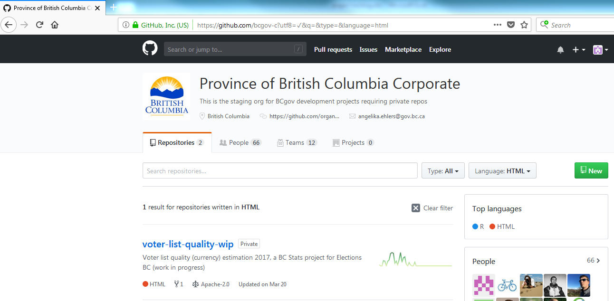
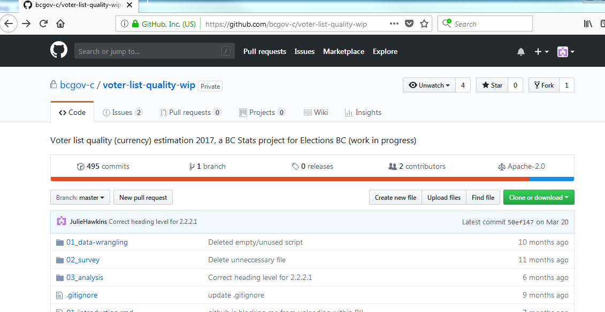
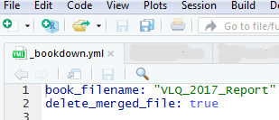
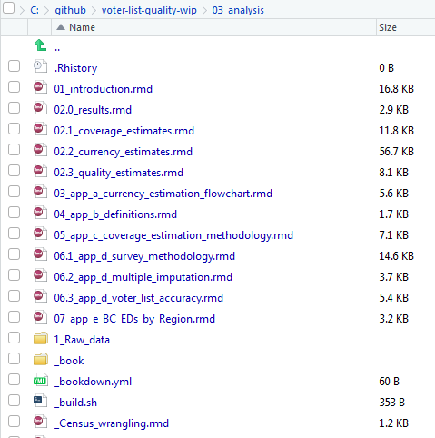

R from Start to Finish: A Case Study
========================================================
autosize:true

Julie Hawkins  
October 11, 2018

<small>Created with Rpres @ https://support.rstudio.com/hc/en-us/articles/200486468 </small>

Overview
========================================================
type:section
left:80%
  
- 
- GitHub & R project
- feather: "a fast, lightweight, and easy-to-use binary file format for storing data frames" short-term as part of analysis^<small>1</small>
- flextable
- bookdown @ https://bookdown.org/

<small>^1: https://blog.cloudera.com/blog/2016/03/feather-a-fast-on-disk-format-for-data-frames-for-r-and-python-powered-by-apache-arrow/ </small>

*** 
   
  

GitHub & R project
========================================================
type:section

@ https://github.com

- connected GitHub repo to an R project to keep files together and organized
- used .gitignore file to ensure that confidential data files did not push to GitHub
- provided version control and issue notification for project with more than one contributor

***
<!--  -->

Feather
========================================================
type:section

- project required working with massive datasets (@1.1 GB text file)
  + needed to sample from N = 1,168,572; reading in 450 MB text file with read_csv took @9 minutes
  + post-survey, read in 551 MB worked on csv file (took @12 minutes)
  + read in 740 MB text file with read_csv (took @15 minutes)
  + merge of these two files with some additional information took HOURS to write_csv
- `library(feather)`
- `write_feather(x, path)`, where file has .feather extension
- `read_feather(path, columns = NULL)`
- took mere minutes to read or write feather file
- returns tibble/dataframe with correct attributes/classes

Flextable
========================================================
type:section

@ https://cran.r-project.org/web/packages/flextable/vignettes/overview.html
- `library(flextable)` and `regulartable` function to format tables
- requires pandoc 2.0 to render
- able to:
  + merge cells
  + add header and footer rows
  + change formatting (e.g., bold, alignment, autofit)
  + add a theme
  + set formatting types (e.g., decimals shown, add percentage symbol, etc.)

  

Bookdown
========================================================
type:section

@ https://bookdown.org/yihui/bookdown/
- install the development versions of `bookdown` from GitHub: `devtools::install_github("rstudio/bookdown")`
- `library(bookdown)` built on R Markdown and knitr
- `bookdown` (and `knitr`) package author: Yihui Xie, a software engineer at RStudio
- project required Word document output
  + `bookdown` meant to output formats such as HTML, PDF, and e-books

Bookdown Learnings
========================================================
left: 70%
type:section

- 
- site: "bookdown::bookdown_site" is REQUIRED to knit all rmds together
- you must have either an `index.rmd` OR `_bookdown.yml` file for bookdown to work 
- `bookdown` will include all .rmd files that are not named starting with an underscore
- number the rmd files for `bookdown` to knit them in order
- each .rmd file that you want in the book must have one and only one chapter (i.e., header with one #)
- use `_build.sh` to run `bookdown`  

***
  
  

Conclusion
========================================================
type:section

- GitHub is overwhelming at first, but is useful especially when there is more than one contributor
- would definitely use `feather` and `flextable` again
- would likely not use `bookdown` again
  + ended up running `bookdown`, opening the Word doc, then applying required styles
  + my lack of experience with bookdown, yaml, R Markdown and knitr
  + LaTeX/Pandoc issues on my computer
  + bookdown's limitations writing to Word doc
  + could consider `officer` package to write to Word doc (or PowerPoint)

Thanks!
========================================================
type:prompt

Any questions?

Julie.Hawkins@gov.bc.ca
